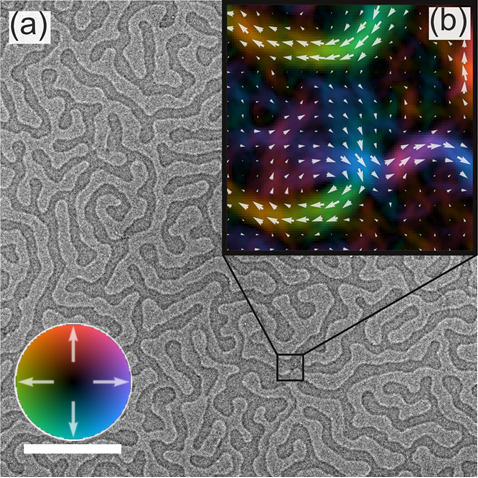

My name is [Jordan Chess](https://scholar.google.com/citations?user=akmy0gUAAAAJ&hl=en), I am currently a Ph.D. candidate at the University of Oregon in the [McMorran lab](http://pages.uoregon.edu/mcmorran/).

My research is focused on using transmission electron microscopes (TEM) to understand magnetic materials.
As part of this work our group is developing new magnetic imaging techniques including electron vortex magnetic chiral dichroism, which is expected to be capable of producing atomic resolution spin maps, and relies on measuring the difference in inelastic scattering rate for electron beams with opposite orbital angular momentum.
In addition to working on new techniques I also use a well established technique Fresnel contrast Lorentz TEM (LTEM), to image skyrmion materials.
LTEM takes advantage of the fact that electrons passing through a magnetic field pick up a phase shift due to the Aharonov-Bohm effect, by examining defocused images of these samples we can gain qualitative information about the magnetic state of the sample such as the location of domain walls, and direction of the domains on either side of the domain walls.
In addition to this qualitative information I also use transport-of-intensity equation (TIE) and/or iterative wave reconstruction techniques applied to images taken at multiple defocus values to determine the phase of the electron wave function exiting the sample from this phase we can quantitatively determine the local magnetic field integrated through the thickness of the sample, like that shown below.

<figure>
    
    <figcaption>
    (a) A Fresnel-contrast LTEM image of the domains present in an \[Fe (3.4Å) / Gd (4Å) / Fe (3.4Å) / Pt (0.25Å) / Ir (0.75Å)\]×80 multilayer film.
    (b) The local magnetic induction integrated though the sample thickness calculated using a <a href="https://arxiv.org/abs/1608.06000">single image transport of intensity equation</a>.
    Color/arrows indicate the strength and magnitude of the magnetic field (see color scale wheel).
    Scale bar 2 µm.
    </figcaption>
</figure>

Most all of my data analysis and figure creation is done using python. Some of these tools can be found [here](https://github.com/jordanchess/LTEM_tools).
